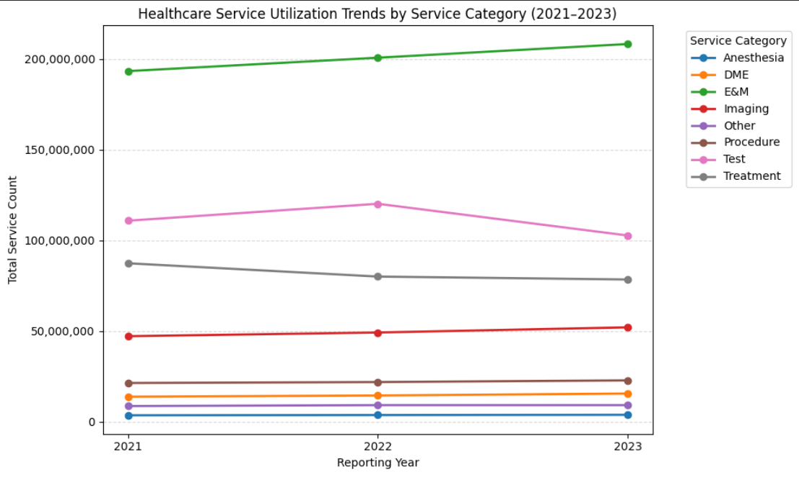

# Healthcare Service Utilization Analysis Using Python

---

---

# 📌 Executive Summary

This project analyzes healthcare service utilization data from California between 2021 to 2023 using Python. The analysis focuses on healthcare service categories, payer types, demographic groups, regional utilization, insurance coverage, and healthcare service utilization trends. Data preprocessing, feature engineering, statistical analysis, and visualization were performed to generate meaningful insights that support healthcare planning and data-driven decision-making.

---

# 🎯 Business Objectives

- Identify the most utilized healthcare service categories.
- Compare healthcare service utilization across different insurance payer types.
- Analyze healthcare utilization by age group and assigned sex at birth.
- Examine regional differences in healthcare service utilization.
- Analyze insurance coverage by payer type and county.
- Identify healthcare utilization trends between 2021 and 2023.

---

# 📂 Dataset Information

| Attribute | Details |
|-----------|----------|
| Dataset | Healthcare Payments Data (HPD) Services Report |
| Source | California Health and Human Services (CalHHS) |
| Location | California, USA |
| Study Period | 2021–2023 |
| Domain | Healthcare Analytics |

---

# 🛠️ Tools & Technologies

- Python
- Google Colab
- Pandas
- NumPy
- Matplotlib
- Seaborn

---

# ⚙️ Project Workflow

- Data Collection
- Initial Data Inspection
- Data Cleaning
- Feature Engineering
- Statistical Analysis
- Exploratory Data Analysis (EDA)
- Data Visualization
- Business Insights

---

# 📊 Project Visualizations

## 1️⃣ Healthcare Service Utilization by Service Category

Shows the distribution of healthcare service utilization across different service categories.

---

## 2️⃣ Healthcare Service Utilization by Payer Type

Compares healthcare service utilization across Medicare, Commercial, and Medi-Cal.

---

## 3️⃣ Demographic Analysis

Analyzes healthcare utilization across age groups and assigned sex at birth.

---

## 4️⃣ Regional Healthcare Utilization

Shows healthcare service utilization across Covered California regions.

---

## 5️⃣ Insurance Coverage by Payer Type

Compares total medical coverage months among payer types.

---

## 6️⃣ Insurance Coverage by County

Displays the top counties based on medical coverage months.

---

## 7️⃣ Healthcare Utilization Trends (2021–2023)

Illustrates healthcare service utilization trends across different service categories.

---

# 💡 Key Findings

- Evaluation & Management (E&M) recorded the highest healthcare service utilization.
- Medicare accounted for the largest share of healthcare service utilization.
- Middle-aged and older adults showed higher healthcare service demand.
- Healthcare utilization varied considerably across California regions.
- Insurance coverage differed across payer types and counties.
- Healthcare service demand changed across service categories between 2021 and 2023.

---

# 🚀 Business Recommendations

- Prioritize resources for high-demand healthcare services.
- Strengthen healthcare planning in high-utilization regions.
- Develop payer-specific healthcare strategies.
- Improve resource allocation using utilization trends.
- Support data-driven healthcare planning and decision-making.

---

## 📁 Repository Structure

text
Healthcare-Service-Utilization-Analysis-Using-Python
│
├── Healthcare Service Utilization Analysis Using Python.pdf
├── Healthcare_Service_Utilization_Analysis.ipynb
├── raw_dataset.csv
├── README.md
├── LICENSE
├── banner.png
├── service_category.png
├── payer_type.png
├── demographic_analysis.png
├── regional_analysis.png
├── insurance_payer.png
├── county_analysis.png
└── trend_analysis.png

---

## 📈 Future Enhancements

- Develop an interactive **Power BI dashboard** for real-time data exploration.
- Build **machine learning models** to predict future healthcare service demand.
- Expand the analysis by incorporating **additional healthcare datasets** from different regions and time periods.
- Integrate **real-time healthcare utilization data** to support continuous monitoring and data-driven decision-making.

---

# 👨‍💻 Author

## Suriya U.S

*Aspiring Data Analyst*

### Skills

- Python
- SQL
- Excel
- Power BI
- Data Analysis

### GitHub

https://github.com/Suriya-Data-Analyst

---

## ⭐ If you found this project useful, consider giving it a Star!
